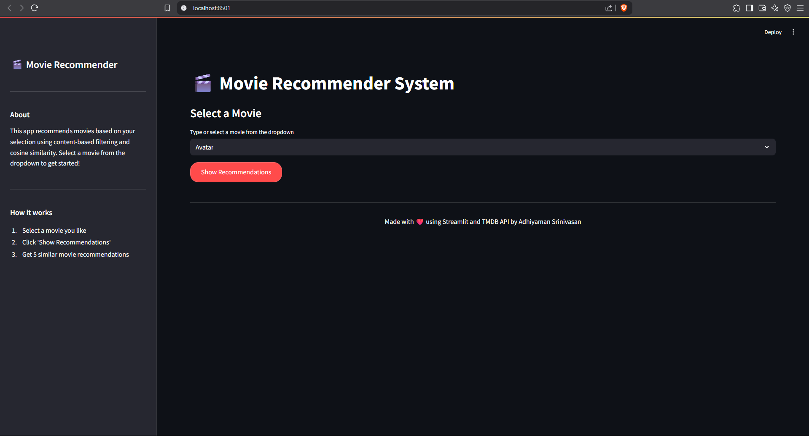
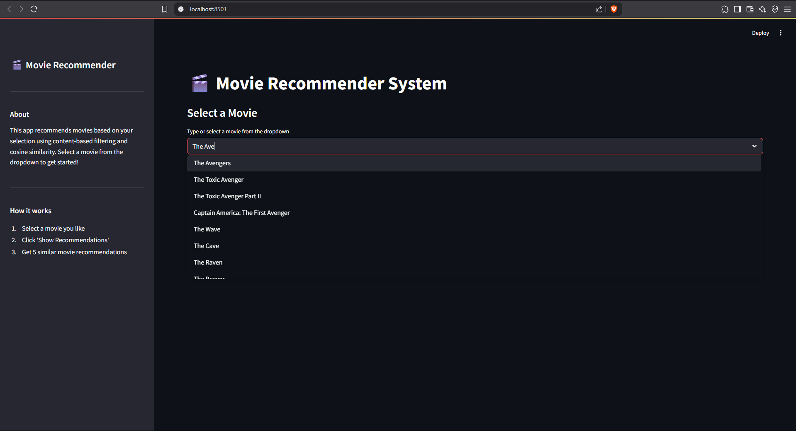
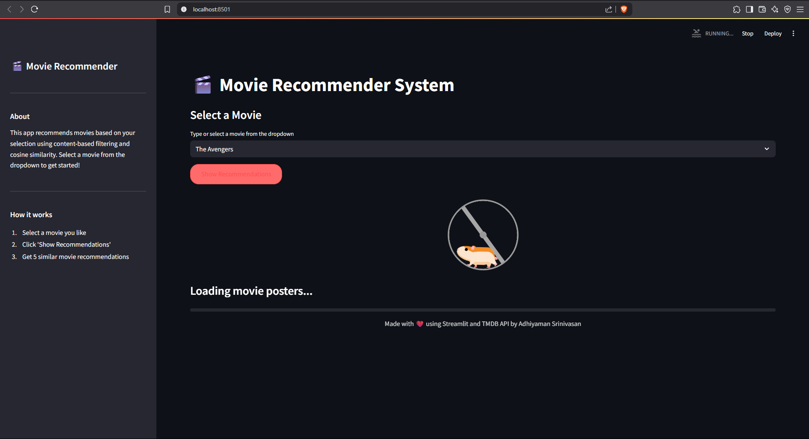
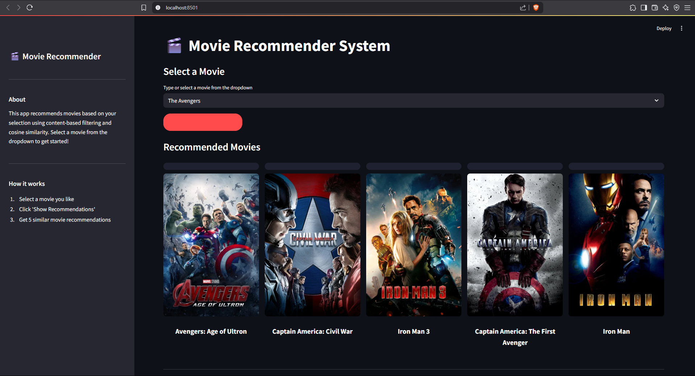

# Movie Recommender System 🎬

A sophisticated content-based movie recommendation system that leverages the TMDB dataset to provide personalized movie suggestions based on genres, cast, and plot analysis.

## 📋 Table of Contents
- [Features](#-features)
- [Screenshots](#-screenshots)
- [Prerequisites](#-prerequisites)
- [Installation](#-installation)
- [TMDB API Setup](#-tmdb-api-setup)
- [Project Structure](#-project-structure)
- [Usage](#-usage)
- [How It Works](#-how-it-works)
- [API Reference](#-api-reference)
- [Contributing](#-contributing)
- [License](#-license)

## ✨ Features
- Content-based movie recommendations
- Genre-based filtering
- Cast and crew analysis
- Plot similarity matching
- User-friendly interface
- Scalable architecture
- TMDB dataset integration

## 📸 Screenshots

### Main Interface

*The main interface of the Movie Recommender System*

### Movie Search

*Searching through the TMDB 5000 movies dataset*

### Movie Fetching

*Fetching and processing movie data from TMDB*

### Recommendation Results

*Example of movie recommendations and results*

## 🔧 Prerequisites
- Python 3.8+
- pip (Python package installer)
- Git
- TMDB API Key

## 🚀 Installation

1. Clone the repository:
```bash
git clone https://github.com/azrael-hash/movie-recommender-system.git
cd movie-recommender-system
```

2. Create and activate a virtual environment:
```bash
python -m venv venv
# On Windows
venv\Scripts\activate
# On Unix or MacOS
source venv/bin/activate
```

3. Install dependencies:
```bash
pip install -r requirements.txt
```

## 🔑 TMDB API Setup

1. **Get Your API Key**:
   - Go to [TMDB Website](https://www.themoviedb.org/)
   - Create an account or log in
   - Go to your profile settings
   - Click on "API" in the left sidebar
   - Request an API key (you'll need to fill out a form)
   - Choose "Developer" option
   - Accept the terms of use
   - Fill in the required information
   - You'll receive your API key (v3 auth)

2. **Set Up Environment Variables**:
   - Create a `.env` file in the project root:
   ```bash
   # On Windows
   copy .env.example .env
   # On Unix or MacOS
   cp .env.example .env
   ```
   - Open the `.env` file and add your API key:
   ```
   TMDB_API_KEY=your_api_key_here
   TMDB_API_BASE_URL=https://api.themoviedb.org/3
   ```
   - Replace `your_api_key_here` with your actual TMDB API key

3. **Verify Setup**:
   - The application will automatically use the API key from the `.env` file
   - You can test the API key by running the application

> ⚠️ **Important**: Never commit your `.env` file or share your API key publicly. The `.env` file is already in `.gitignore` to prevent accidental commits.

## 📁 Project Structure
```
movie-recommender-system/
├── mrs/                    # Main application directory
│   ├── app.py             # Main application file
│   └── ...
├── movie-recommender.ipynb # Jupyter notebook for development
├── requirements.txt        # Project dependencies
├── .env.example           # Environment variables template
├── .gitignore             # Git ignore file
└── README.md              # Project documentation
```

## 💻 Usage

1. Start the application:
```bash
python mrs/app.py
```

2. Access the web interface at `http://localhost:5000`

3. Enter a movie title to get personalized recommendations

## 🔍 How It Works

The system uses a content-based filtering approach:

1. **Data Processing**
   - Loads TMDB dataset
   - Processes movie metadata
   - Extracts features from plots and genres

2. **Feature Engineering**
   - Text vectorization
   - Genre encoding
   - Cast and crew analysis

3. **Similarity Calculation**
   - Cosine similarity computation
   - Weighted feature matching
   - Recommendation ranking

## 📚 API Reference

### Main Functions

#### `get_recommendations(movie_title: str, n_recommendations: int = 5)`
Returns a list of recommended movies based on the input movie title.

Parameters:
- `movie_title`: Name of the movie
- `n_recommendations`: Number of recommendations to return

Returns:
- List of recommended movies with similarity scores

## 🤝 Contributing

1. Fork the repository
2. Create your feature branch (`git checkout -b feature/AmazingFeature`)
3. Commit your changes (`git commit -m 'Add some AmazingFeature'`)
4. Push to the branch (`git push origin feature/AmazingFeature`)
5. Open a Pull Request

## 📄 License

This project is licensed under the MIT License - see the [LICENSE](LICENSE) file for details.

## 👥 Authors

- **Adhiya** - *Initial work* - [azrael-hash](https://github.com/azrael-hash)

## 🙏 Acknowledgments

- TMDB for providing the dataset and API
- All contributors who have helped shape this project
